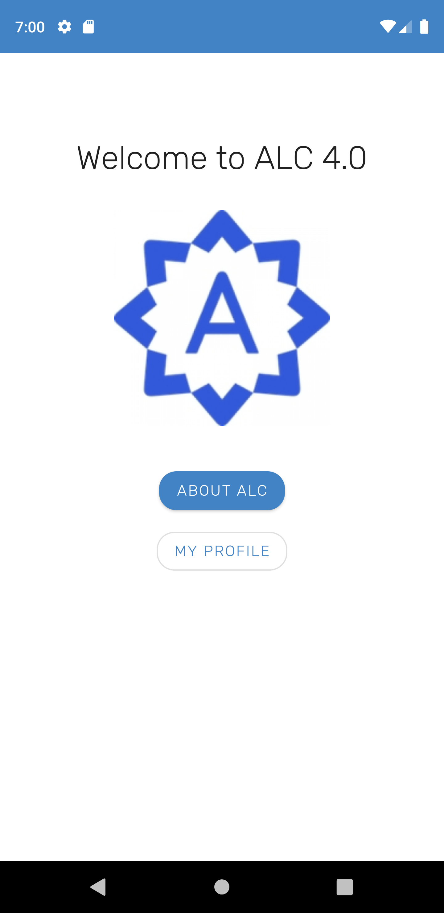

# GondaiMganoALCChallengeOne
ALC challenge show case
using Kotlin and Databinding and Material Design

Databinding which is smart and clean using kotlin

## A preview of my MainActivity.kt onCreate() function

```
override fun onCreate(savedInstanceState: Bundle?) {
        super.onCreate(savedInstanceState)

       val binding=   DataBindingUtil.setContentView<ActivityMainBinding>(this,R.layout.activity_main)
        binding.handler=MainScreenHandler()

    }

    override fun onBackPressed() {
        finish()
        super.onBackPressed()
    }
```




